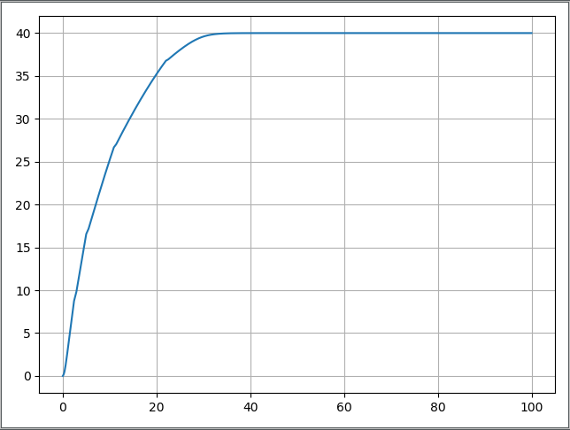
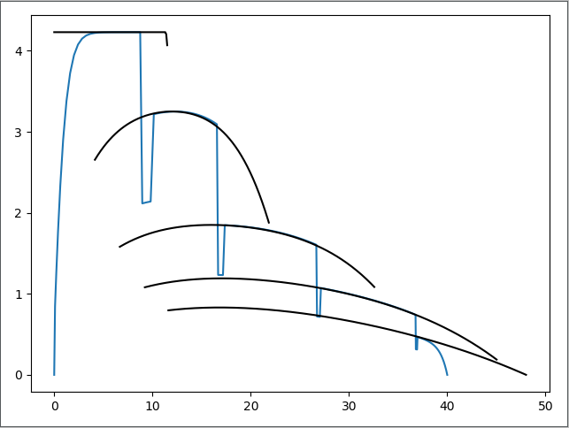

.. figure:: ./co2mpas_driver/images/co2mpas_driver_logo.png
    :align: center
    :alt: alternate text
    :figclass: align-center

.. _start-info:

:versions:      |gh-version| |rel-date| |python-ver|
:documentation: Under construction.
:sources:       https://github.com/JRCSTU/co2mpas_driver  |codestyle|
:keywords:      automotive, car, cars, driver, MCF, driving, simulation, simulator, standard, vehicle, vehicles.
:short name:    co2mpas_driver
:live-demo:     |binder|
:Copyright and License:     © Copyright (c) 2021 European Union.

              Licensed under the EUPL, Version 1.2 or – as soon they will be approved by the European Commission – subsequent versions of the EUPL (the "Licence");
              You may not use this work except in compliance with the Licence.
              You may obtain a copy of the Licence at: |proj-lic|

              Unless required by applicable law or agreed to in writing, software distributed under the Licence is distributed on an "AS IS" basis, WITHOUT WARRANTIES OR CONDITIONS
              OF ANY KIND, either express or implied. See the Licence for the specific language governing permissions and limitations under the Licence.

A python-3.6+ package to generate the *gear-shifts* of Light-duty vehicles

.. _end-info:

.. contents:: Table of Contents
  :backlinks: top

.. _start-intro:

Introduction
============

Co2mpas_driver is a library used to implement the microsimulation free-flow acceleration model (MFC).
The MFC is able to accurately and consistently capture the acceleration dynamics of road vehicles
using a lightweight and parsimonious approach. The model has been developed to be integrated in traffic
simulation environments to enhance the realism of vehicles movements, to explicitly take into account
driver behaviour during the vehicle acceleration phases, and to improve the estimation of fuel/energy
consumptions and emissions, without significantly increasing their computational complexity. The proposed model
is valid for both internal combustion engine and battery electric vehicles. The MFC has been developed by the Joint
Research Centre of the European Commission in the framework of the Proof of Concept programme 2018/2019.
For more details on the model please refer to Makridis et al. `(2019) <https://doi.org/10.1177/0361198119838515>`__
and He et al. `(2020) <https://doi.org/10.1177/0361198120931842>`__.

.. _end-intro:

.. _start-installation:

Installation
============
Prerequisites
-------------
**Python-3.6+** is required and **Python-3.7+** recommended.

.. Tip::
    On *Windows*, it is preferable to use the `Anaconda <https://www.anaconda.com/products/individual>`__ distribution.
    To avoid possible incompatibilities with other projects, it is recommended to install the package in a dedicated.

Download
--------
Download the sources,

- either with *git*, by giving this command to the terminal::

      git clone https://github.com/JRCSTU/co2mpas_driver --depth=1

Install
-------
From within the project directory, run one of these commands to install it:

- for standard python, installing with ``pip`` is enough (but might)::

      pip install -e .[path_to_co2mpas_driver]

or from @master branch::

        pip install git+https://github.com/JRCSTU/co2mpas_driver.git@master

Uninstall
---------
To uninstall the package, run the following command from the project directory::

        pip uninstall co2mpas_driver

.. _end-installation:

.. _start-usage:

Usage
=====

In this example we will use co2mpas_driver model in order to extract the drivers
acceleration behavior as approaching the desired speed.

Setup
-----
* First, set up python, numpy, matplotlib.

    set up python environment: numpy for numerical routines, and matplotlib
    for plotting

        >>> import numpy as np
        >>> import matplotlib.pyplot as plt

* Import dispatcher(dsp) from co2mpas_driver that contains functions
  and simulation model to process vehicle data and Import also schedula
  for selecting and executing functions. for more information on how to use
  schedula https://pypi.org/project/schedula/

      >>> from co2mpas_driver import dsp
      >>> import schedula as sh

Load data
---------
* Load vehicle data for a specific vehicle from vehicles database

        >>> db_path = 'EuroSegmentCar.csv'

* Load user input parameters from an excel file

      >>> input_path = 'sample.xlsx'

* Sample time series

      >>> sim_step = 0.1 #The simulation step in seconds
      >>> duration = 100 #Duration of the simulation in seconds
      >>> times = np.arange(0, duration + sim_step, sim_step)

* Load user input parameters directly writing in your sample script

      >>> inputs = {
      'vehicle_id': 35135,  # A sample car id from the database
      'inputs': {'gear_shifting_style': 0.7, #The gear shifting style as
                                              described in the TRR paper
                  'starting_speed': 0,
                 'desired_velocity': 40,
                 'driver_style': 1},  # gear shifting can take value
      # from 0(timid driver) to 1(aggressive driver)
      'time_series': {'times': times}
      }

Dispatcher
----------
* Dispatcher will select and execute the proper functions for the given inputs
  and the requested outputs

      >>> core = dsp(dict(db_path=db_path, input_path=input_path, inputs=inputs),
         outputs=['outputs'], shrink=True)

* Plot workflow of the core model from the dispatcher

      >>> core.plot()

  This will automatically open an internet browser and show the work flow
  of the core model as below. you can click all the rectangular boxes to see
  in detail sub models like load, model, write and plot.

  .. image:: ./co2mpas_driver/images/core_example.PNG
      :align: center
      :alt: dispatcher
      :height: 400px
      :width: 500px

  **The Load module**

 .. image:: ./co2mpas_driver/images/load_example.PNG
      :align: center
      :alt: dispatcher
      :height: 400px
      :width: 500px

**Merged vehicle data for the vehicle_id used above**

 .. image:: ./co2mpas_driver/images/data.PNG
      :align: center
      :alt: dispatcher
      :height: 400px
      :width: 500px

* Load outputs of dispatcher
  Select the chosen dictionary key (outputs) from the given dictionary.

      >>> outputs = sh.selector(['outputs'], sh.selector(['outputs'], core))

* select the desired output

      >>> output = sh.selector(['Curves', 'poly_spline', 'Start', 'Stop', 'gs',
                    'discrete_acceleration_curves', 'velocities',
                    'accelerations', 'transmission'], outputs['outputs'])

  The final acceleration curves, the engine acceleration potential
  curves (poly_spline), before the calculation of the resistances and the
  limitation due to max possible acceleration (friction).

      >>> curves, poly_spline, start, stop, gs, discrete_acceleration_curves, \
      velocities, accelerations, transmission = \
      output['Curves'], output['poly_spline'], output['Start'], output['Stop'], output['gs'], \
      output['discrete_acceleration_curves'], output['velocities'], \
      output['accelerations'], output['transmission'], \

  curves: Final acceleration curves
  poly_spline:
  start and stop: Start and stop speed for each gear
  gs:
  discrete_acceleration_curves
  velocities:
  accelerations:

Plot
----
    >>> plt.figure('Time-Speed')
    >>> plt.plot(times, velocities)
    >>> plt.grid()
    >>> plt.figure('Speed-Acceleration')
    >>> plt.plot(velocities, accelerations)
    >>> plt.grid()
    >>> plt.figure('Acceleration-Time')
    >>> plt.plot(times, accelerations)
    >>> plt.grid()

    >>> plt.figure('Speed-Acceleration')
    >>> for curve in discrete_acceleration_curves:
        sp_bins = list(curve['x'])
        acceleration = list(curve['y'])
        plt.plot(sp_bins, acceleration, 'k')
    >>> plt.show()

Results
-------

**Figure 1.** Speed(m/s) versus time(s) graph over the desired speed range.

Acceleration(m/s*2) versus speed(m/s) graph

**Figure 2.** Acceleration per gear, the gear-shifting points and final acceleration potential of our selected
  vehicle over the desired speed range

Acceleration(m/s*2) versus speed graph(m/s)

.. image:: ./co2mpas_driver/images/acc-time.PNG
      :align: center
      :alt: dispatcher
      :height: 400px
      :width: 500px

**Figure 3.** The final acceleration potential of our selected vehicle over the desired speed range.
.. _end-usage::

.. _start-sub:

.. |python-ver| image::  https://img.shields.io/badge/PyPi%20python-3.5%20%7C%203.6%20%7C%203.7%20%7C%203.8%20%7C%203.9%20%7C%203.10%20-informational
    :alt: Supported Python versions of latest release in PyPi

.. |gh-version| image::  https://img.shields.io/badge/GitHub%20-TODO-orange
    :target: https://github.com/JRCSTU/gearshift/releases
    :alt: Latest version in GitHub

.. |rel-date| image:: https://img.shields.io/badge/rel--date-2020/01/12-orange
    :target: https://github.com/JRCSTU/gearshift/releases
    :alt: release date

.. |br| image:: https://img.shields.io/badge/docs-working%20on%20that-red
    :alt: GitHub page documentation

.. |doc| image:: https://img.shields.io/badge/docs-passing-success
    :alt: GitHub page documentation

.. |proj-lic| image:: https://img.shields.io/badge/license-European%20Union%20Public%20Licence%201.2-lightgrey
    :target:  https://joinup.ec.europa.eu/software/page/eupl
    :alt: EUPL 1.2

.. |codestyle| image:: https://img.shields.io/badge/code%20style-black-black.svg
    :target: https://github.com/ambv/black
    :alt: Code Style

.. |pypi-ins| image:: https://img.shields.io/badge/pypi-v1.1.3-informational
    :target: https://pypi.org/project/wltp-gearshift/
    :alt: pip installation

.. |binder| image:: https://mybinder.org/badge_logo.svg
    :target: https://mybinder.org/v2/gh/JRCSTU/co2mpas_driver/master?urlpath=lab/tree/examples
    :alt: JupyterLab for Gerashift Calculation Tool (stable)

.. |CO2| replace:: CO\ :sub:`2`

.. _end-sub:
