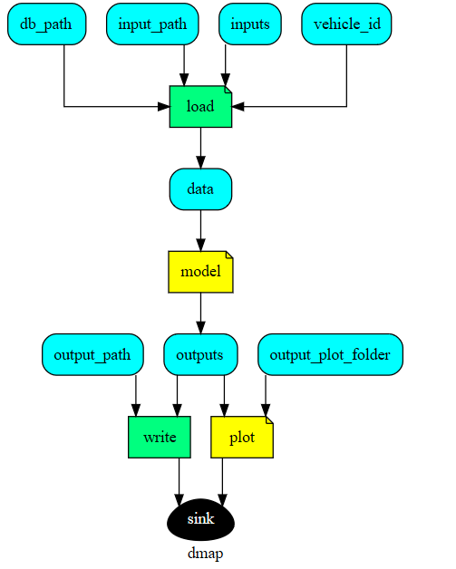
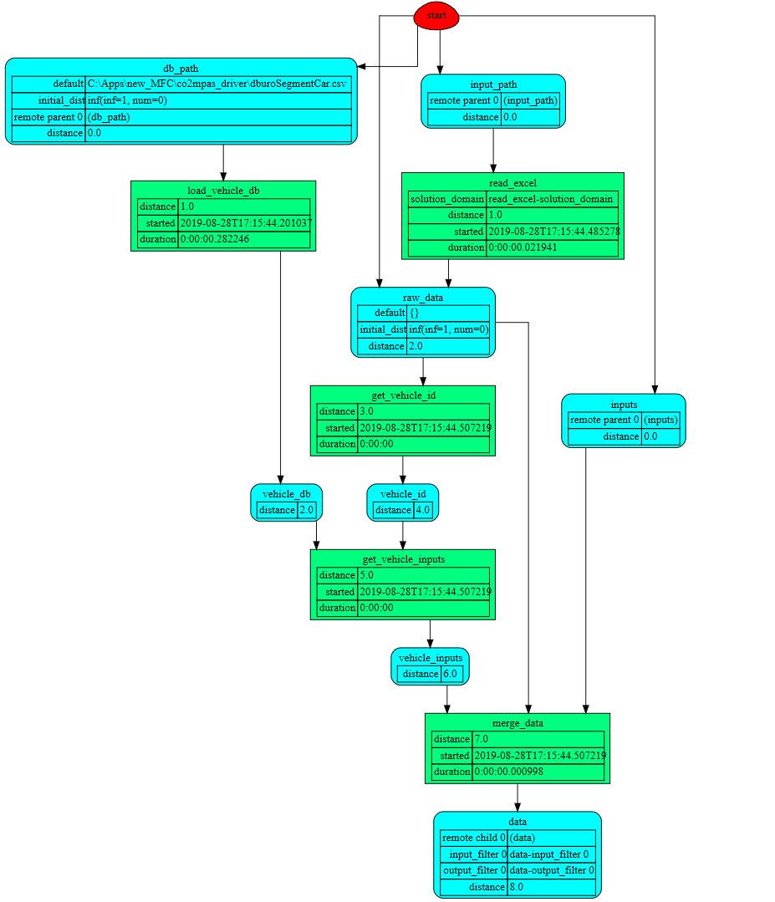

## User guidelines for co2mpas_driver
<!--move them to CONTRIBUTING.md -->

This page contains user guidelines intended for first time users of co2mpas_driver 
library. It contains the explanations and definitions required to understand how to use
the the library. These guidelines are written for users without specific IT knowledge.
for more details https://journals.sagepub.com/doi/10.1177/0361198119838515

## Design diagram

   

1. **Load module.** This model loads vehicle specifications based on the vehicle id
 and user input(gear shifting style, driver style, desired velocity) parameters 
 for the execution of simulation model in order to extract the drivers acceleration
 behavior as approaching the desired speed

    * **Inputs** :
    
        1. db_path: file path for vehicle database based on the Euro car segment
           classification
        2. input_path: file path to an excel file that contains user input parameters
        3. inputs: users provide some parameters directly from console
        4. vehicle_id: Id for a specific vehicle
    
    * **output** :
        
        1. data: this returns a data-value tree which is used as an input for 
           running simulation model. 

   

2. **Simulation Model.** 

    * **Run simulation:** This part runs simulation of 

3. **Installing new_MFC package**
    This package can be installed easily on any machine that has pip 
    from python package index using a requirement specifier 
    
        pip install new_MFC 

4. **How to use co2mpas_driver library**:
    In this example we will use new_MFC model in order to extract the drivers 
    acceleration behavior as approaching the desired speed.
    
    a. **Setup** 
       
      * First, set up python, numpy, matplotlib.
      
        set up python environment: numpy for numerical routines, and matplotlib 
        for plotting
        
            import numpy as np
            import matplotlib.pyplot as plt
       
      * Import dispatcher(dsp) from co2mpas_driver that contains functions 
        and a model `dsp` to processes to process vehicle data.
         
            from co2mpas_driver import dsp
            import schedula as sh
       
      * Load vehicle data for a specific vehicle from vehicles database
       
            db_path = osp.abspath(osp.join(osp.dirname(my_dir + '/../'),
                                   'co2mpas_driver', 'db',
                                   'EuroSegmentCar.csv'))
            
      * Load user input parameters from an excel file
       
            input_path = osp.abspath(osp.join(osp.dirname(my_dir + '/../'),
                                      'co2mpas_driver', 'template',
                                      'sample.xlsx'))     
      
      * Load user input parameters from an excel file
       
            inputs = {
            'vehicle_id': 35135,  # A sample car id from the database
            'inputs': {'gear_shifting_style': 0.7, 'starting_speed': 0,
                       'desired_velocity': 40,
                       'driver_style': 1},  # gear shifting can take value
            # from 0(timid driver) to 1(aggressive driver)
            'time_series': {'times': times}
        }      
            
[1]: https://ljvmiranda921.github.io/notebook/2018/06/21/precommits-using-black-and-flake8/
[2]: https://black.readthedocs.io/  