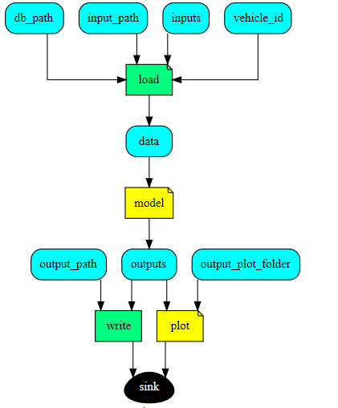

## User guidelines for co2mpas_driver
<!--move them to CONTRIBUTING.md -->

This page contains user guidelines intended for first users of co2mpas_driver model.
It contains the explanations and definitions required to understand how to use
the model, understand its needs, and analyse its outputs. These guidelines are
written for users without specific IT knowledge.

## Design diagram

   

1. **Load module.** This loads 

    * **Inputs** :
    
        1. db_path: file path for vehicle database based on the Euro car segment
           classification
        2. input_path: file path to an excel file that contains user input parameters
        3. inputs: user input parameters
        4. vehicle_id: Id for a specific vehicle
    
    * **output** :
        
        1. data: this returns a data-value tree which is used as an input for 
           running simulation model. 

   

This function loads

2. **Simulation Model.** 

    1. **Run simulation:** This part runs simulation of 
