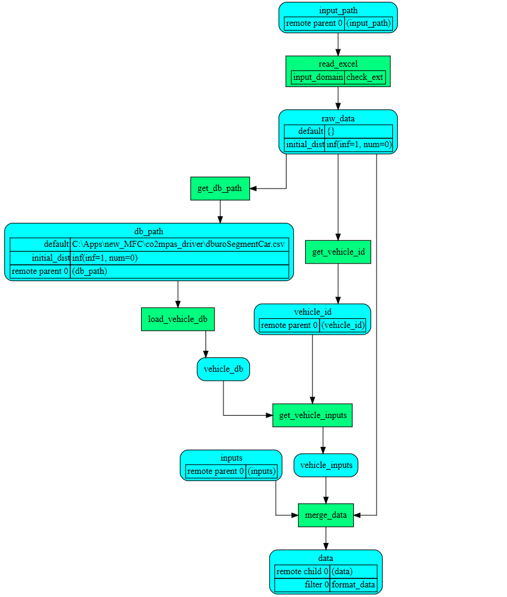

# The present work implements a lightweight microsimulation free-flow acceleration model (MFC) that is able to capture the vehicle acceleration dynamics accurately and consistently, it provides a link between the model and the driver and can be easily implemented and tested without raising the computational complexity. The proposed model has been developed by the Joint Research Centre of the European Commission. 

# Please cite: Makridis, M., Fontaras, G., Ciuffo, B.F., Mattas, K., 2019. MFC free-flow model: Introducing vehicle dynamics in microsimulation. TRR.

## User guidelines for co2mpas_driver library
<!--move them to CONTRIBUTING.md -->

This page contains user guidelines intended for first users of co2mpas_driver model.
It contains the explanations and definitions required to understand how to use
the model, understand its needs, and analyse its outputs. These guidelines are
written for users without specific IT knowledge.

Design diagram

        

1. Load module.
 

        

This function loads 
