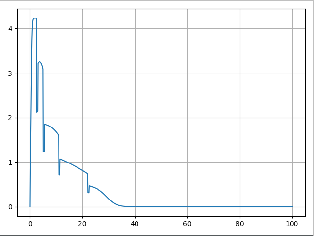

Usage
=====

In this example we will use co2mpas_driver model in order to extract the drivers
acceleration behavior as approaching the desired speed.

Setup
-----
* First, set up python, numpy, matplotlib.

    set up python environment: numpy for numerical routines, and matplotlib
    for plotting

        >>> import numpy as np
        >>> import matplotlib.pyplot as plt

* Import dispatcher(dsp) from co2mpas_driver that contains functions
  and simulation model to process vehicle data and Import also schedula
  for selecting and executing functions. for more information on how to use
  schedula https://pypi.org/project/schedula/

      >>> from co2mpas_driver import dsp
      >>> import schedula as sh

Load data
---------
* Load vehicle data for a specific vehicle from vehicles database

        >>> db_path = 'EuroSegmentCar.csv'

* Load user input parameters from an excel file

      >>> input_path = 'sample.xlsx'

* Sample time series

      >>> sim_step = 0.1 #The simulation step in seconds
      >>> duration = 100 #Duration of the simulation in seconds
      >>> times = np.arange(0, duration + sim_step, sim_step)

* Load user input parameters directly writing in your sample script

      >>> inputs = {
      'vehicle_id': 35135,  # A sample car id from the database
      'inputs': {'gear_shifting_style': 0.7, #The gear shifting style as
                                              described in the TRR paper
                  'starting_speed': 0,
                 'desired_velocity': 40,
                 'driver_style': 1},  # gear shifting can take value
      # from 0(timid driver) to 1(aggressive driver)
      'time_series': {'times': times}
      }

Dispatcher
----------
* Dispatcher will select and execute the proper functions for the given inputs
  and the requested outputs

      >>> core = dsp(dict(db_path=db_path, input_path=input_path, inputs=inputs),
         outputs=['outputs'], shrink=True)

* Plot workflow of the core model from the dispatcher

      >>> core.plot()

  This will automatically open an internet browser and show the work flow
  of the core model as below. you can click all the rectangular boxes to see
  in detail sub models like load, model, write and plot.

  .. image:: ../co2mpas_driver/images/core_example.PNG
      :align: center
      :alt: dispatcher
      :height: 400px
      :width: 500px

  **The Load module**

 .. image:: ../co2mpas_driver/images/load_example.PNG
      :align: center
      :alt: dispatcher
      :height: 400px
      :width: 500px

**Merged vehicle data for the vehicle_id used above**

 .. image:: ../co2mpas_driver/images/data.PNG
      :align: center
      :alt: dispatcher
      :height: 400px
      :width: 500px

* Load outputs of dispatcher
  Select the chosen dictionary key (outputs) from the given dictionary.

      >>> outputs = sh.selector(['outputs'], sh.selector(['outputs'], core))

* select the desired output

      >>> output = sh.selector(['Curves', 'poly_spline', 'Start', 'Stop', 'gs',
                    'discrete_acceleration_curves', 'velocities',
                    'accelerations', 'transmission'], outputs['outputs'])

  The final acceleration curves, the engine acceleration potential
  curves (poly_spline), before the calculation of the resistances and the
  limitation due to max possible acceleration (friction).

      >>> curves, poly_spline, start, stop, gs, discrete_acceleration_curves, \
      velocities, accelerations, transmission = \
      output['Curves'], output['poly_spline'], output['Start'], output['Stop'], output['gs'], \
      output['discrete_acceleration_curves'], output['velocities'], \
      output['accelerations'], output['transmission'], \

  curves: Final acceleration curves
  poly_spline:
  start and stop: Start and stop speed for each gear
  gs:
  discrete_acceleration_curves
  velocities:
  accelerations:

Plot
----
    >>> plt.figure('Time-Speed')
    >>> plt.plot(times, velocities)
    >>> plt.grid()
    >>> plt.figure('Speed-Acceleration')
    >>> plt.plot(velocities, accelerations)
    >>> plt.grid()
    >>> plt.figure('Acceleration-Time')
    >>> plt.plot(times, accelerations)
    >>> plt.grid()

    >>> plt.figure('Speed-Acceleration')
    >>> for curve in discrete_acceleration_curves:
        sp_bins = list(curve['x'])
        acceleration = list(curve['y'])
        plt.plot(sp_bins, acceleration, 'k')
    >>> plt.show()

Results
-------

.. image:: ../co2mpas_driver/images/speed-time.PNG
      :align: center
      :alt: dispatcher
      :height: 400px
      :width: 500px

**Figure 1.** Speed(m/s) versus time(s) graph over the desired speed range.

Acceleration(m/s*2) versus speed(m/s) graph

.. image:: ../co2mpas_driver/images/acce-speed.PNG
      :align: center
      :alt: dispatcher
      :height: 400px
      :width: 500px

**Figure 2.** Acceleration per gear, the gear-shifting points and final acceleration potential of our selected
  vehicle over the desired speed range

Acceleration(m/s*2) versus speed graph(m/s)

**Figure 3.** The final acceleration potential of our selected vehicle over the desired speed range.